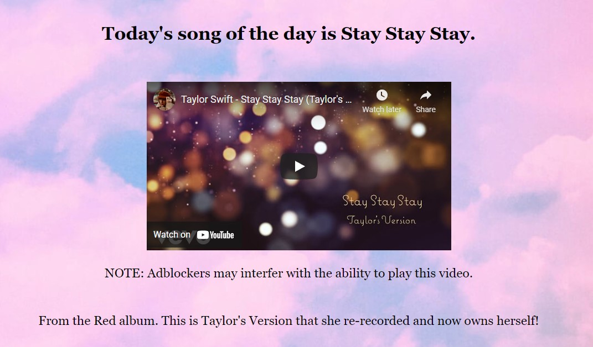

# My Awesome Project
This is an api that will send a daily Taylor Swift song. It sends the name, youtube link, album, lyrics, and whether or not Taylor owns the masters.

**Link to project:** 

## How It's Made:

**Tech used:** HTML, CSS, JavaScript, Node.js, Express

This api runs on Node.js with the help of express. When you send a request to the /sotd page it will return a json object with the daily song and related info.

A randomize function is used with Math.random() to pick a random number, which corrolates to a song. Then that number is added to an array of used songs. This function will recursively run until a number that is not already in the array is picked. The song correlating to this number will serve as the song of the day. Once the length of the array is equal to the number of songs in the song object, the array will be set to an empty array.

This randomize function is run once a day, at midnight Eastern time to pick a new song of the day. This is accomplished through a cronjob. 

The html, css, and frontend js files serve as a landing page with information about the api and documentation on how to use it.

## Optimizations

Some of the songs have an empty string for the lyrics because the video is a lyrics video. Eventually I would like to add the lyrics to all songs, regardless of video type. I also want to add other endpoints that let your query based on song name, album, and whether or not Taylor owns the masters to the song.

## Lessons Learned:

I learned how to use a cronjob to schedule tasks to happen at certain intervals. This can be done every minute, every hour, daily, weekly, monthly, or yearly. It's a very powerful automation tool. I also learned how to use node to serve json data. I learned to deploy a project to Heroku via the command line.

